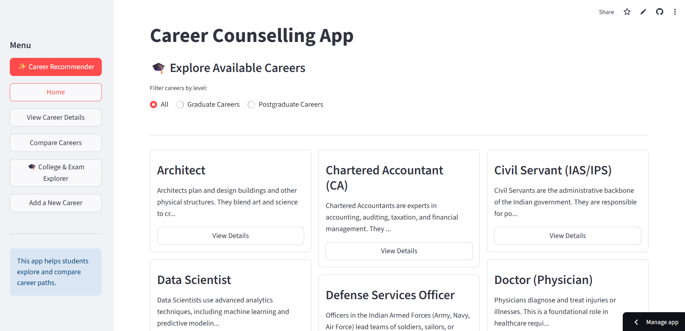
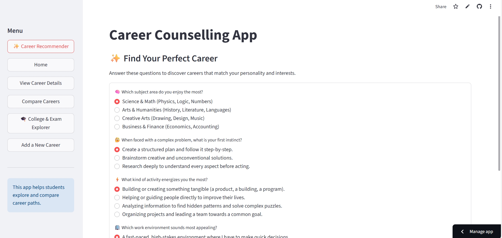
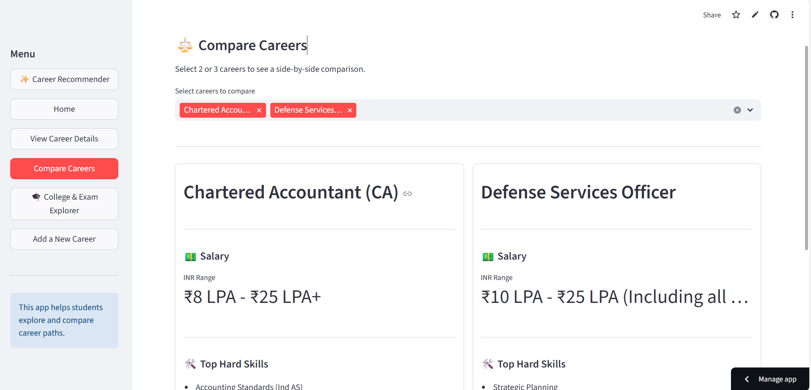
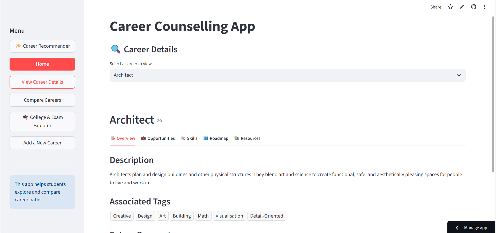
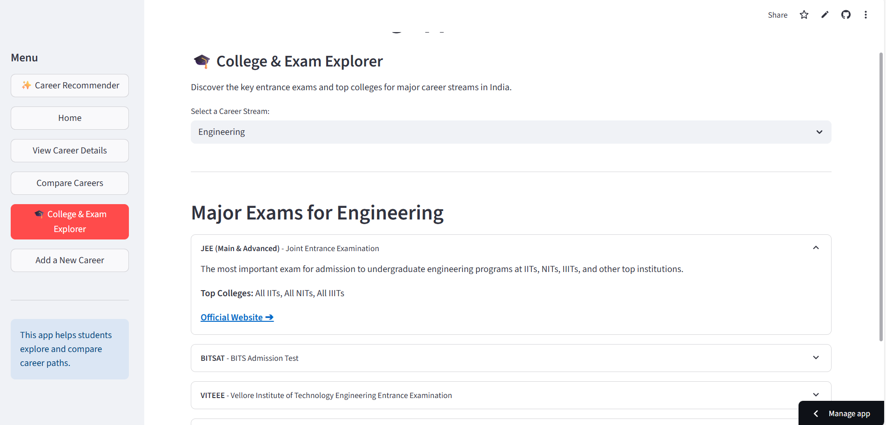

# 🎓 Career Counselling App

An interactive Streamlit web application designed to help students explore career options, compare different career paths, discover relevant skills, and find entrance exams and colleges associated with different career streams.

## ✨ Features

### 🏠 Career Exploration
- Explore careers across different fields
- Filter careers based on education level
- View career descriptions and associated degrees

### 🧠 Personalized Career Recommender
- Answer a short interest and personality-based questionnaire
- Matches user responses with career tags
- Provides the top 3 recommended careers
- Shows the percentage match and common interests

### 🔍 Career Details
Explore detailed information about individual careers, including:
- Career overview
- Future prospects
- Salary range
- Career opportunities
- Technical and soft skills
- Career roadmap
- Learning resources

### ⚖️ Career Comparison
Compare up to three careers side-by-side based on:
- Salary range
- Key technical skills
- Career roadmap

### 🎓 College & Exam Explorer
- Explore major entrance exams
- View exam information
- Discover associated colleges
- Access official exam websites

## 🛠️ Tech Stack

- Python
- Streamlit
- JSON
- Git & GitHub

## 📁 Project Structure

```text
career_counselling_app/
│
├── app.py
├── careers.json
├── exams.json
├── assets/
├── requirements.txt
├── .gitignore
└── README.md
```

## 🚀 Getting Started

### 1. Clone the repository

```bash
git clone https://github.com/lalithya-munigala/career_counselling_app.git
cd career_counselling_app
```

### 2. Install dependencies

```bash
pip install -r requirements.txt
```

### 3. Run the application

```bash
streamlit run app.py
```

The application will open in your browser.

## 🧩 How the Career Recommendation Works
The recommender uses tags associated with each career and compares them with tags generated from the user's quiz responses.
The application calculates a matching score based on the overlap between the user's interests and career tags, then presents the top matching careers.

## 📚 Data
Career and examination information is stored in JSON files:
careers.json — career fields, descriptions, skills, salaries, roadmaps, opportunities, and resources
exams.json — entrance examination and college information

## 🔮 Future Improvements
- Add more career fields and career options
- Improve recommendation accuracy using a more advanced recommendation model
- Add user profiles and saved career recommendations
- Add more college and examination information
- Deploy the application for wider student use

## 📸 Application Screenshots
### 🏠 Home


### 🧠 Career Recommender


### ⚖️ Career Comparison


### 🔍 Career Details


### 🎓 College & Exam Explorer


## 👩‍💻 Author
Lalithya Munigala
Computer Science Undergraduate
BITS Pilani, Hyderabad Campus
